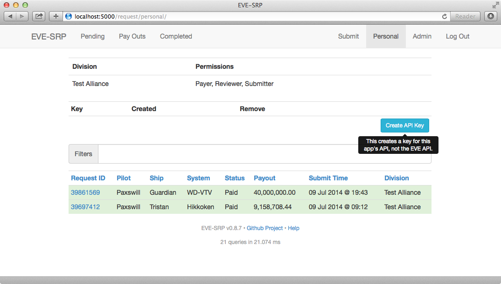

.. _external-api:

************
External API
************

EVE-SRP provides read-only access to requests you can access to external
applications. Responses can be formatted as XML or JSON depending on your
requirements. The URLs for the API are the same ones you access normally in a
web browser, just in a different format.

API Keys
========

The first step to using the external API is to create an API key.
Click the "Create API Key" button, and a key will be generated.

You can revoke API keys at any time by clicking the "X" in the "Remove" column.
The key is the string of letters and numbers and can be copied to your
clipboard by clicking on its button (requires Flash).

To use the API key, provide it as a parameter in the query string along with
the desired format.
The parameter name for the key is ``apikey`` and the field name for the format
is ``fmt``, and valid values are ``json`` or ``xml``.

Lists of Requests
=================

You can retrieve lists of up to 200 requests per page through the API.
Filtering and sorting options are applied the same way they are when viewing
the lists as HTML. In addition to the ``personal``, ``pending``, ``pay`` and
``completed`` lists exposed in the UI, there is an ``all`` route that will
list all requests you have access to. As with the other lists that show
requests other than your own, you must have a permission greater than
'submitter' granted to you in a division to access those lists.

JSON
----

In response to
``http://example.com/request/personal/?apikey=dVbP0_SCPS12LnLpIZoJvemzeUUOOUErT7nojbJW4_I,&fmt=json``

.. literalinclude:: code/api-personal.json

XML
---

In response to
``http://example.com/request/personal/?apikey=dVbP0_SCPS12LnLpIZoJvemzeUUOOUErT7nojbJW4_I,&fmt=xml``

.. literalinclude:: code/api-personal.xml
    :language: xml

RSS
---

An RSS feed for requests in a list is available by adding ``/rss.xml`` to the
end of a list URL. For example, the URL for the feed of pending requests would
be
``http://example.com/request/pending/rss.xml?apikey=dVbP0_SCPS12LnLpIZoJvemzeUUOOUErT7nojbJW4_I``

Request Details
===============

If you need details beyond that provided in the lists of requests, or to look
up information on a specific request you can access a request's URL through the
API. For example, the request for killmail
`#39861569 <https://zkillboard.com/kill/39861569/>`_ in JSON format could be
retrieved with the URL
``http://example.com/request/39861569/?apikey=dVbP0_SCPS12LnLpIZoJvemzeUUOOUErT7nojbJW4_I,&fmt=json``.
The path for an individual requests is also returned as part of the response in
request listings.

JSON
----

.. literalinclude:: code/api-detail.json

XML
---

.. literalinclude:: code/api-detail.xml
    :language: xml
