##########
User Guide
##########

**********************************
Logging in and Submitting Requests
**********************************

When you first access a website running EVE-SRP, you will be asked to login.
Select the appropriate login option if you are presented with multiple choices,
enter your credentials and login.

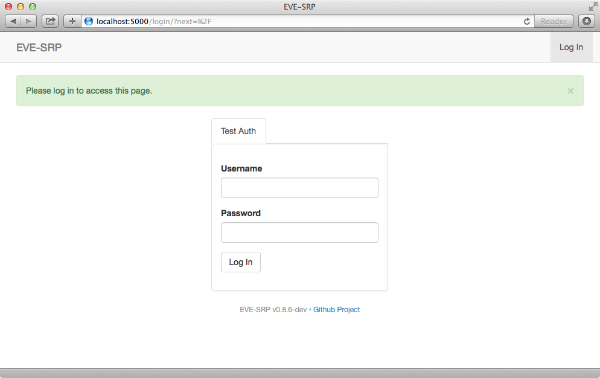

Once you have logged in, you will be able to see what reimbursement divisions
you have been granted permissions in as well as all of the requests you have
submitted.

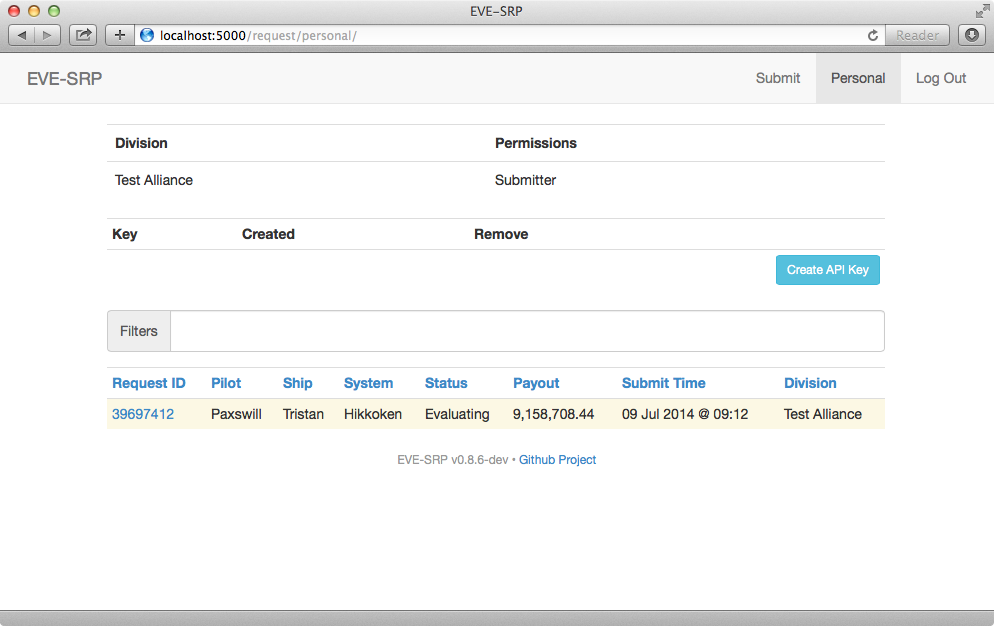

To submit a request, click the "Submit" button at the top of the
screen. The button will only be present if you have been granted the submit
privilege within a division.

In the form, enter a killmail URL and any details your organization normally
requires. What kind of killmail URLs that are acceptable is up to your
organization, but common choices are zKillboard based killboards or CREST
killmail URLs from an in-game killmail. Click the "Submit" button once you are
done entering the information.

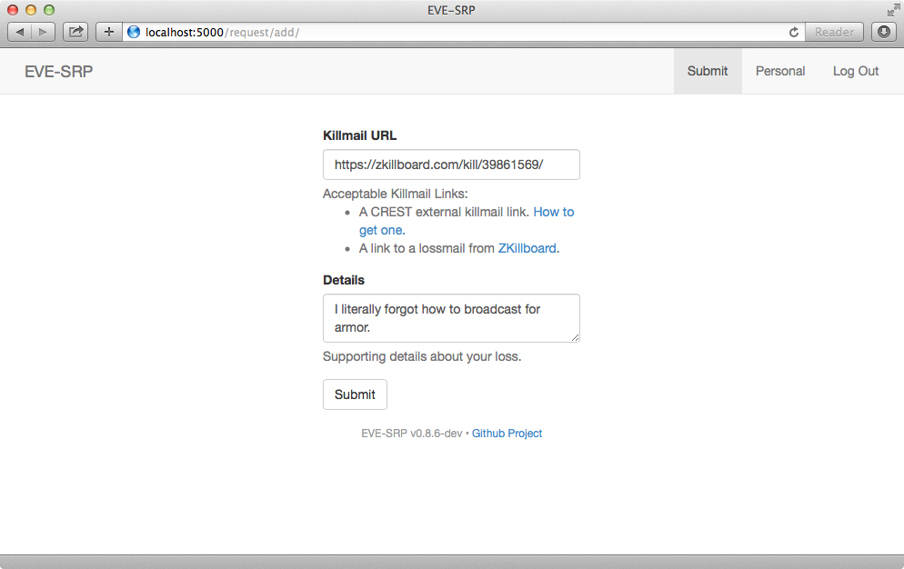

You will be redirected to the request detail page once you have submitted your
request. Via this page you can add comments for reviewers, or update the
details to correct problems.

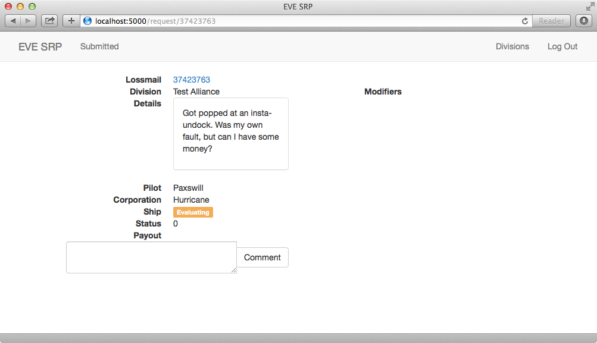

******************
Reviewing Requests
******************

If you have the review permission in a division and are logged in, you can
click on the "Review" link at the top of the screen to see a list
of requests that are not in a final (paid or rejected) state, and are thus able
to be reviewed. Unevaluated requests have a yellow background, incomplete and
rejected have a red background, approved (pending payout) have blue, and paid
requests have a green background. To open a request, click the Request ID link
(blue text).

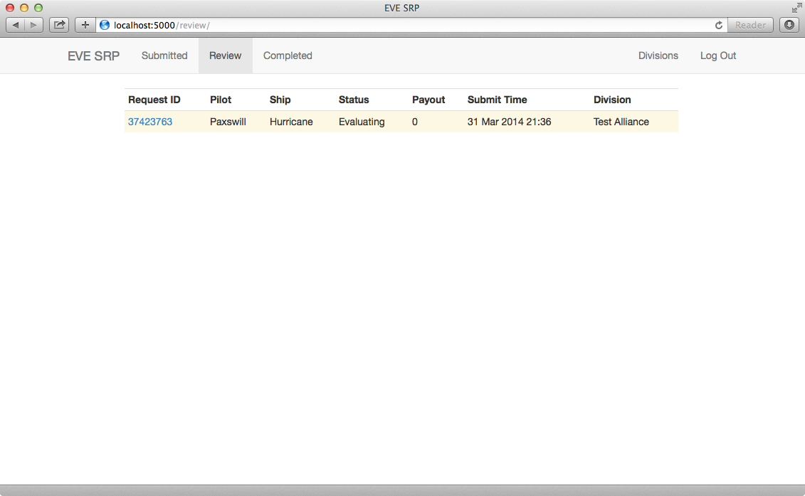

In addition to the controls available to a normal user, reviewers have a few
extra available. The base payout can be set by entering a value (in millions of
ISK) and clicking the "Set" button.

.. image:: images/set_payout.png

To apply bonuses and/or deduction, enter an amount in the "Add Modifier" form,
enter a reason for the modifier, and then select the type of modifier from the
dropdown button labeled, "Type". The effect of modifiers are calculated in the
order they are added.

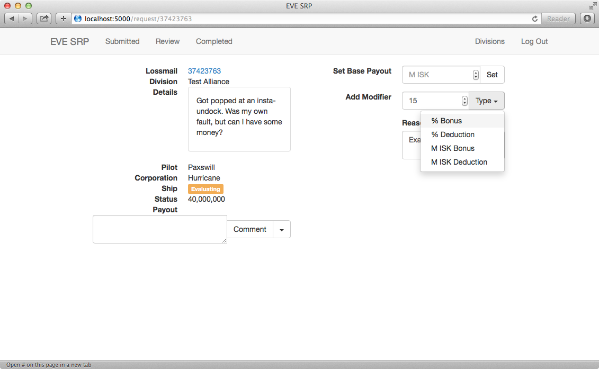

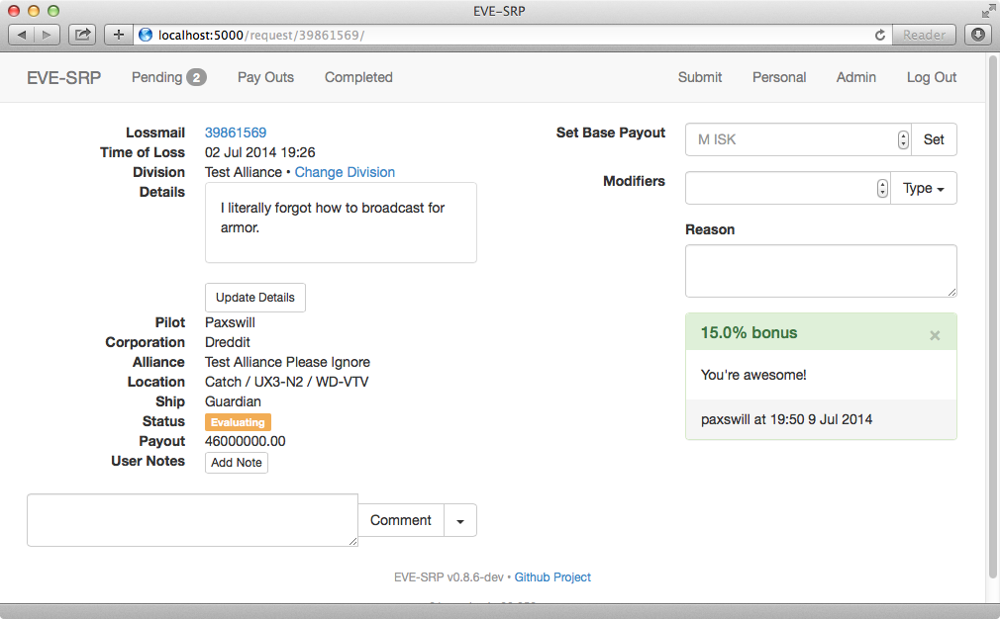

If you make a mistake on a modifier and the request is still in the evaluating
state, you can void the modifier by clicking the small "X".

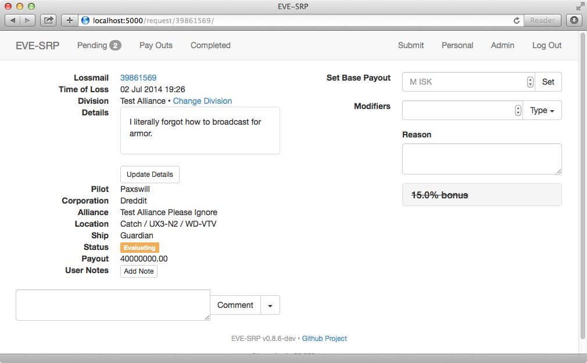

Once you have applied all the modifiers you want/need, you can change the
status of the request using the same interface used for commenting. Enter a
reason for the status change in the comment box, click the dropdown button to
the right of the "Comment" button, and finally click the new status you want
applied.

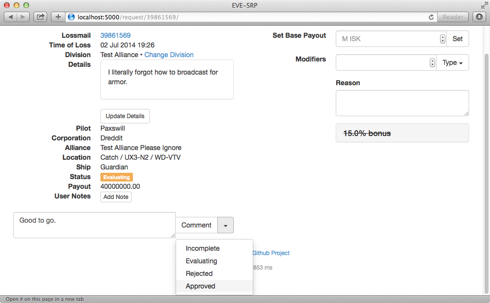

If you missed something and need to add or void a modifier, or even change the
base payout, you can set approved (but not yet paid) requests back to
evaluating.

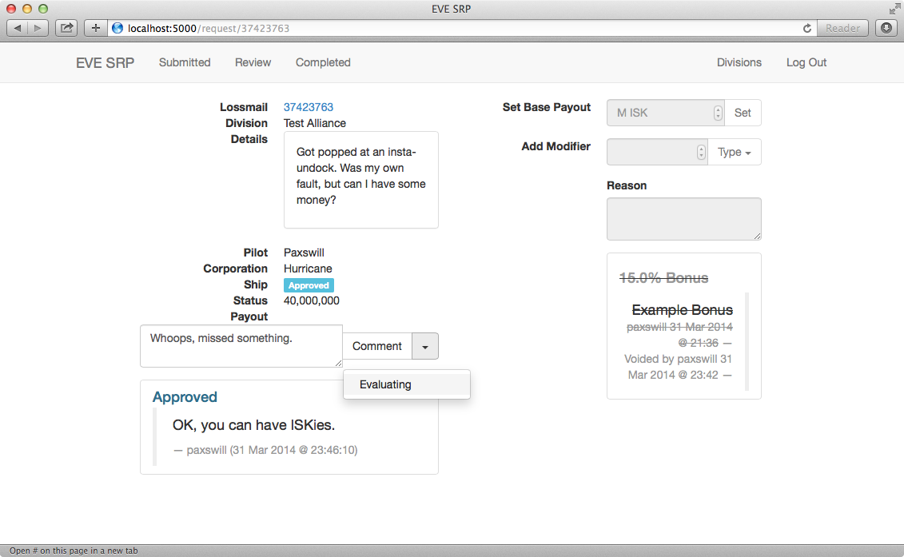

Finally, you can see a list of completed (paid or rejected) requests by
clicking the "Completed" link at the top of the screen.

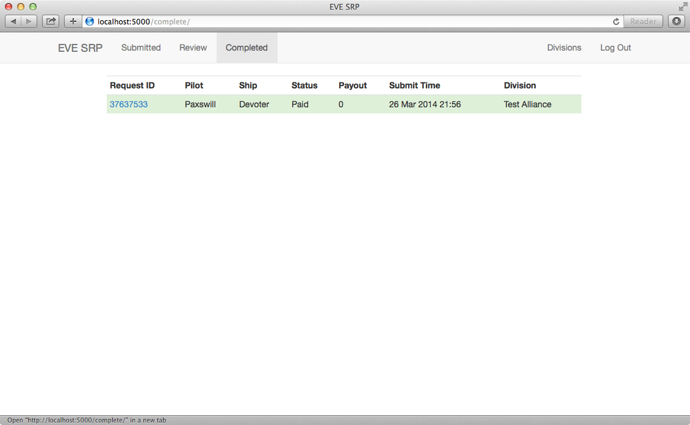

*******************
Paying Out Requests
*******************

TODO

***********************
Administering Divisions
***********************

A fresh installation of EVE-SRP will not have any divisions configured, so
one of the first actions after installation should be to configure divisions.
If you have either the global administrator or a divisional administrator
permission, you will have a "Divisions" button at the top of the screen.

.. image:: images/list_divisions.png

To add a division, click the "Add Division" button, enter a name on the form,
then click the "Create Division" button. Afterwards you will be taken to the
administration page for the new division. To grant a permission to a group,
enter the group name then click the "Add Group" button. The process for adding
users is identical. User and group names are case sensitive!

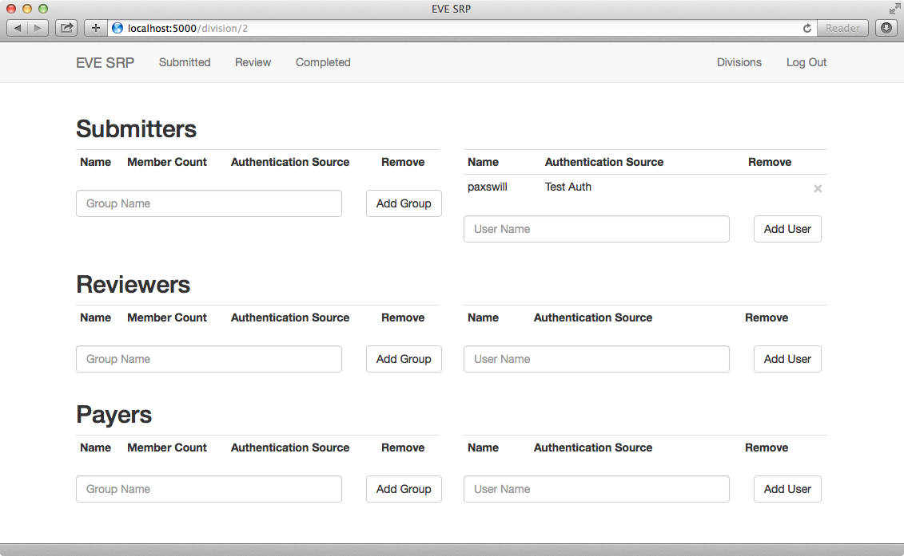

To revoke privileges to a user or group, click the "X" in the "Remove" column.
