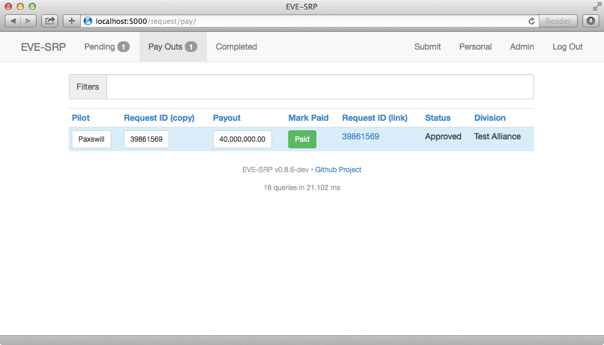
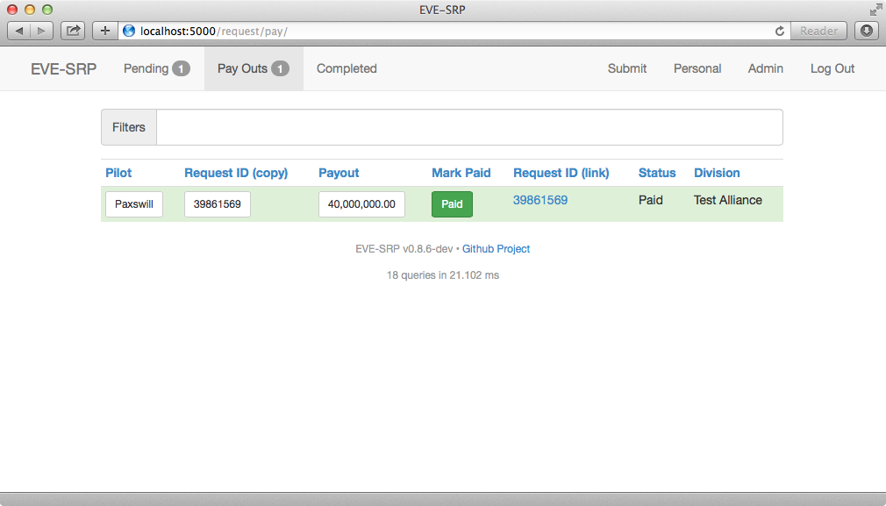
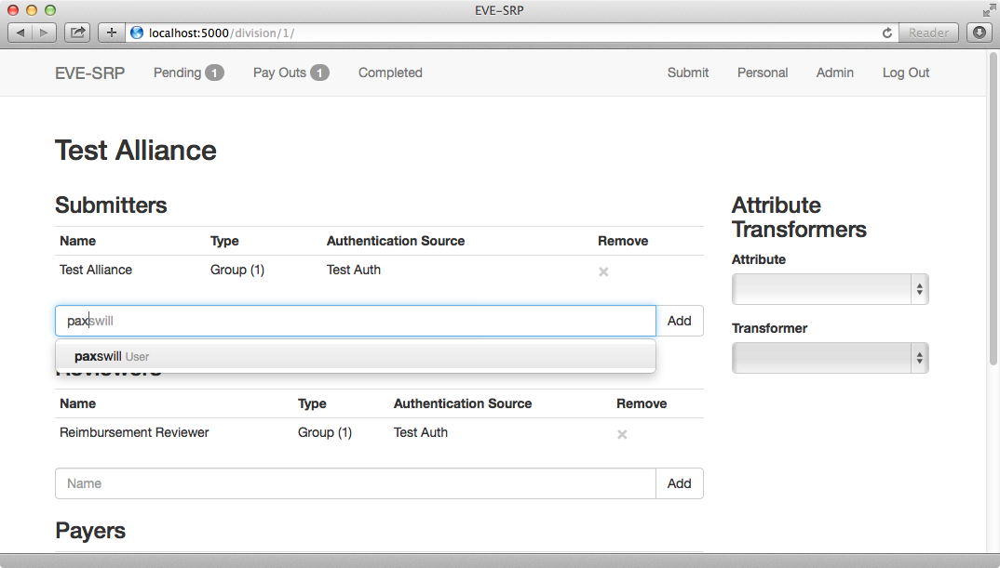
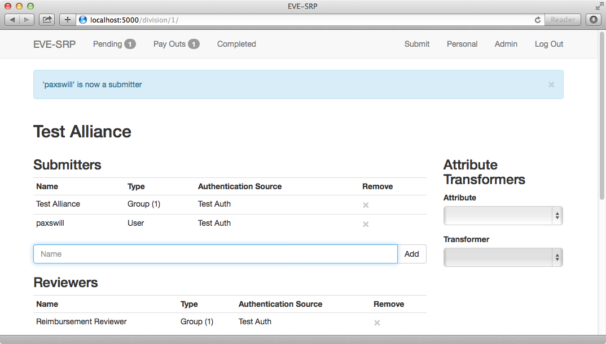

##########
User Guide
##########

**********************************
Logging in and Submitting Requests
**********************************

When you first access a website running EVE-SRP, you will be asked to login.
Select the appropriate login option if you are presented with multiple choices,
enter your credentials and login.

.. image:: images/login.png

Once you have logged in, you will be able to see what reimbursement divisions
you have been granted permissions in as well as all of the requests you have
submitted.

.. image:: images/personal.png

To submit a request, click the "Submit" button at the top of the
screen. The button will only be present if you have been granted the submit
privilege within a division.

In the form, enter a killmail URL and any details your organization normally
requires. What kind of killmail URLs that are acceptable is up to your
organization, but common choices are zKillboard based killboards or CREST
killmail URLs from an in-game killmail. Click the "Submit" button once you are
done entering the information.

.. image:: images/submit_form.png

You will be redirected to the request detail page once you have submitted your
request. Via this page you can add comments for reviewers, or update the
details to correct problems.

.. image:: images/request_submitted.png

******************
Reviewing Requests
******************

If you have the review permission in a division and are logged in, you can
click on the "Pending" link at the top of the screen to see a list
of requests that are not in a final (paid or rejected) state, and are thus able
to be reviewed. The number of requests that are in the "Evaluating" state is
displayed in the number badge next to the "Pending" button.

In the list of requests, unevaluated requests have a yellow background,
incomplete and
rejected have a red background, approved (pending payout) have a blue one, and
paid requests have a green background. To open a request, click the Request ID
link (blue text).

.. image:: images/list_submitted.png

In addition to the controls available to a normal user, reviewers have a few
extra controls available. The base payout can be set by entering a value
(in millions of ISK) and clicking the "Set" button.

.. image:: images/set_payout.png

To apply bonuses and/or deduction, enter an amount in the "Add Modifier" form,
enter a reason for the modifier, and then select the type of modifier from the
dropdown button labeled, "Type". Absolute modifiers (adding or subtracting a
set amount of ISK) are applied first, followed by percentage
deductions/bonuses.

.. image:: images/add_modifier.png

.. image:: images/applied_modifier.png

If you make a mistake on a modifier and the request is still in the evaluating
state, you can void the modifier by clicking the small "X".

.. image:: images/voided_modifier.png

Once you have applied all the modifiers you want/need, you can change the
status of the request using the same interface used for commenting. Enter a
reason for the status change in the comment box, click the dropdown button to
the right of the "Comment" button, and finally click the new status you want
applied.

.. image:: images/approving.png

If you missed something and need to add or void a modifier, or even change the
base payout, you can set approved (but not yet paid) requests back to
evaluating.

.. image:: images/evaluating.png

*******************
Paying Out Requests
*******************

If you have the payer permission for a division, you can mark requests as paid.
Typically this is handled by someone with access to the wallet in-game used to
hold the SRP money.

The number of requests pending payout is displayed in the number badge to the
right of the "Pay Outs" button. This butotn is only visible if you have the
payer permission. Click the button to see a list of approved requests.

This list tries to make paying out requests as quick as possible. Clicking one
of the white buttons (under the "Pilot", "Request ID (copy)", or "Payout"
columns) will copy the text within to your clipboard, making it quicker to
enter the information in-game. The clipboard functionality requires Flash, so
it should be done using an out of game browser. The work flow should be
something like this:

1. Copy Pilot name from app using standard web browser.

2. Paste the name in a search box for transferring money (either frmo a corp
   wallet or a personal wallet). Select the user and have the Give/Transfer ISK
   dialog box up.

3. Copy payout amount from app.

4. Paste payout amount into the amount box in-game.

5. Copy the request ID from the app.

6. Paste the request ID into the reason box in-game. Click the OK button to
   transfer the money.

7. Once the transfer has completed, click the green "Paid" button. This will
   mark the request as paid.

If you need to go back and fix something in a request, or to review them
beforehand, you can clik the request ID text (the blue link).

***********************
Administering Divisions
***********************

A fresh installation of EVE-SRP will not have any divisions configured, so
one of the first actions after installation should be to configure divisions.
If you have either the site administrator or administrator in a division,
you will have an "Admin" button at the top of the screen. Clicking it will list
all of the divisions you can administer. 

.. image:: images/list_divisions.png

If you are a site administrator you will also see a button for creating
divisions. To add a division, click the "Add Division" button, enter a name on
the form, then click the "Create Division" button.

After creating a new division or clicking one of the links in the division
listing, you will see the administration page for that division.
To grant a permission to a user or group, start typing the name of that user or
group in the text box corresponding to that permission. It will autocomplete
their name if the app knows about it (i.e. if they've logged in before or a
user in that group has logged in before).

Either click the correct entry, or finish typing it out and click the "Add"
button. To revoke privileges to a user or group, click the "X" in the "Remove"
column.

Divisions can be configured to have certain request attributes to be changed
into links. This is covered in more detail in the (TODO) transformers section.

