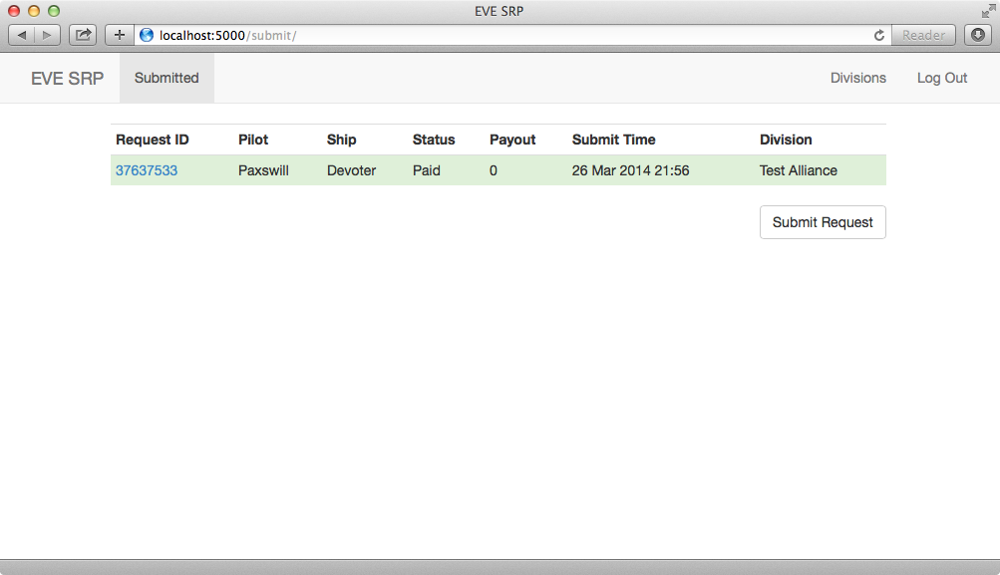

Users
=====

Logging in and Submitting Requests
**********************************

When you first access a website running EVE-SRP, you will be asked to login.
Select the appropriate login option if you are presented with choices, enter
your credentials and login.

.. image:: images/login.png

Once you have logged in, you will be able to see what reimbursement divisions
you have been granted permissions in. To submit a request, click on the
"Submit" link at the top of the screen. This page will list all requests you
have filed, regardless of final status and your current privileges.
If you have the submit permission on any divisions, there will be a button at
the bottom of the window with the text, "Submit Request". Click it.

Enter a killmail URL that is accepted by your organization, for example , API
verified killmail from zKIllboard. Enter in any requested supporting details
and then click the "Submit" button.

.. image:: images/submit_form.png

After that, you will be redirected to the request detail page. You can get back
here by clicking on the link for this request on the listing of requests you
say earlier. You can also add comments and reply to comments made by reviewers.

.. image:: images/request_submitted.png

Reviewing Requests
******************

If you have the review permission in a division and are logged in, you can
click on the "Review" link at the top of the window. There, you will see a list
of requests that are not in a final (paid or rejected) state, and are thus able
to be reviewed. Unevaluated requests have a yellow highlight, incomplete and
rejected have a red highlight, approved (pending payout) have blue, and paid
requests have a green highlight. To open a request, click the Request ID link,
in blue.

.. image:: images/list_submitted.png

In this interface, you have a number of control available to you. When the
request is in an evaluating state you can set the base payout and add and
remove payout modifiers liek bonuses and deductions. To set the base payout,
enter a value in the appropriate text box and then click the "Set" button.

.. image:: images/set_payout.png

To apply bonuses and/or deduction, enter an amount in the "Add Modifier" form,
Enter a reason for the modifier, and then select the type of modifier from the
dropdown button labeled, "Type". Modifiers are applied in the order they are
added.

.. image:: images/add_modifier.png

.. image:: images/applied_modifier.png

If you make a mistake on a modifier and the request ius still in the evaluating
state, you can void it by clickint the small "X".

.. image:: images/voided_modifier.png

Once you have applied all the modifiers you want/need, you can change the
status of the request the same way you'd comment. Enter a reason for the status
change in the comment box, and then click the dropdown button to the right of
the "Comment" button. Click the new status you want applied, and that's it.

.. image:: images/approving.png

If you missed something and need to add or void a modifier, or even change the
base payout, you can set approved (but not paid) requests back to evaluating.

.. image:: images/evaluating.png

Finally, you can see a list of completed (paid of rejected) requests by
clicking the "Completed" link at the top of the window.

.. image:: images/list_completed.png
